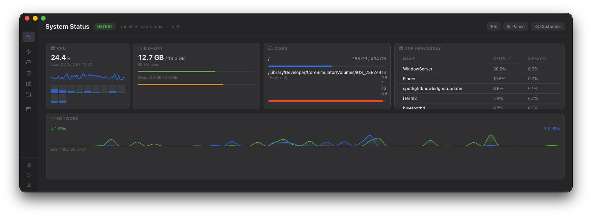
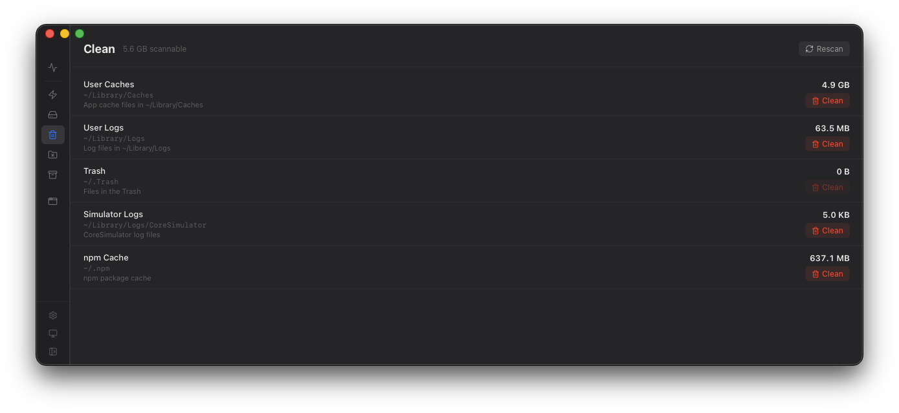
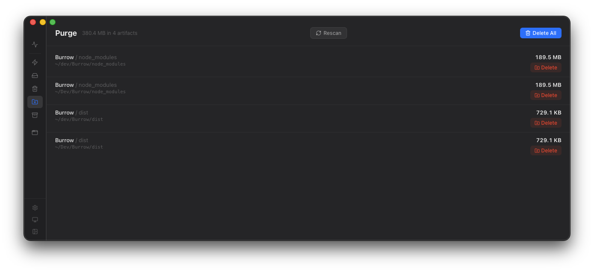
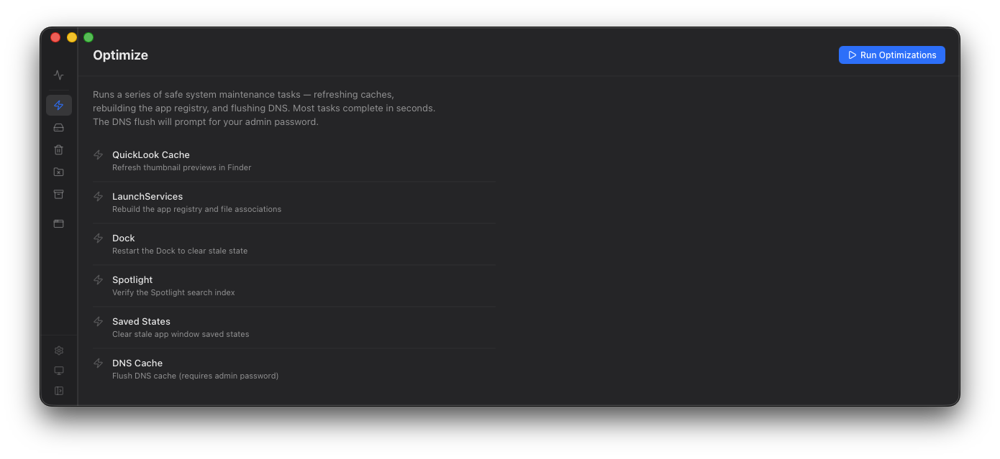
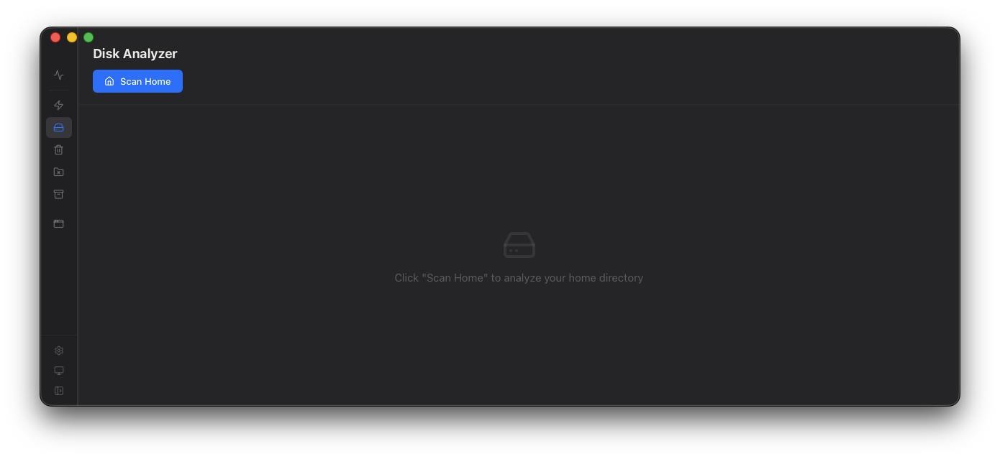
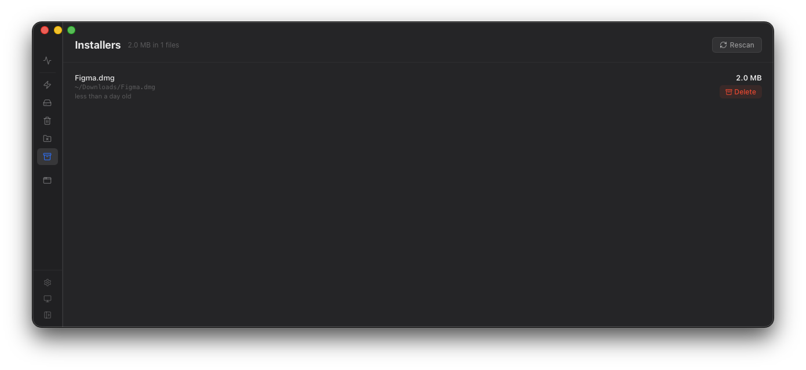
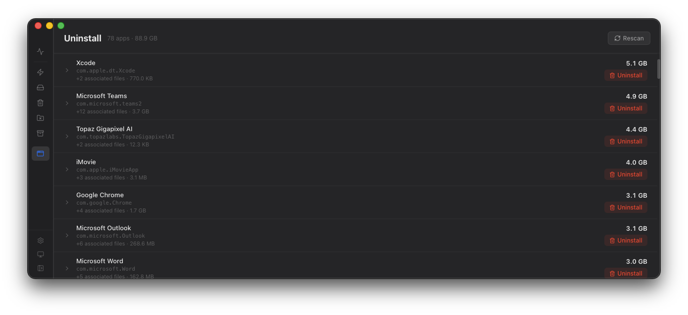
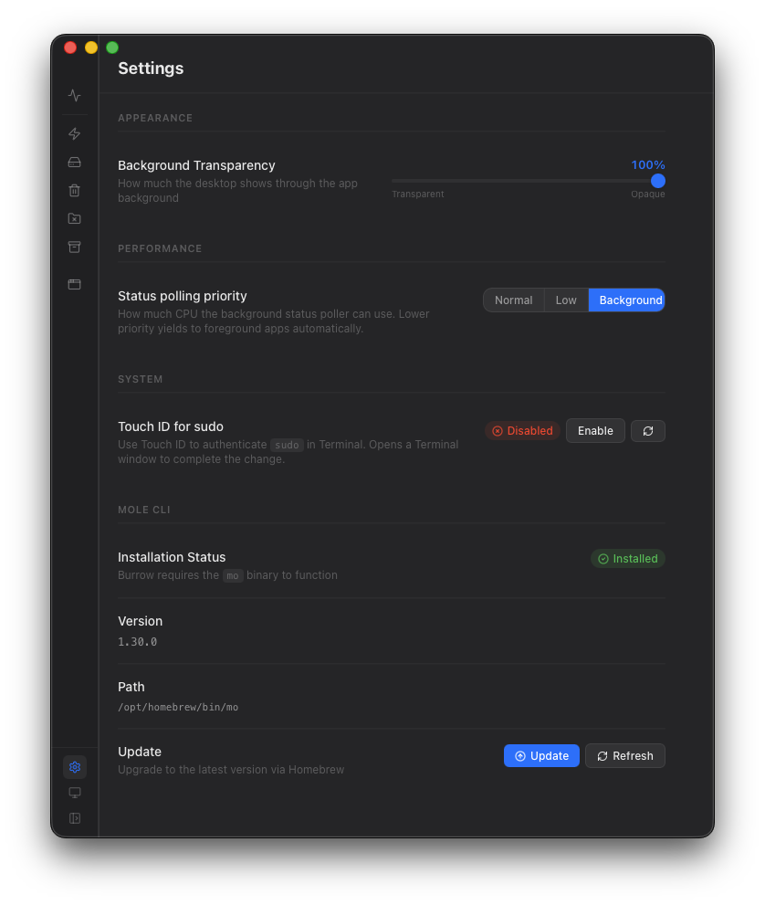

# Burrow

  

  

**A native macOS app for cleaning, optimising, and monitoring your Mac.**

Burrow is a polished GUI frontend for [Mole](https://github.com/tw93/mole) — the macOS deep-clean and system-monitoring CLI tool by [tw93](https://github.com/tw93). It brings all of Mole's power into a single, always-available window with live metrics, a visual disk browser, and one-click maintenance — wrapped in a translucent, vibrancy-backed interface that feels at home on macOS.

> Mole is bundled inside Burrow — no separate install required.

---

## Changelog

### v0.2.0
- **Memory pressure gauge** — live indicator (Normal / Warning / Critical) shown as a vertical colour bar in the Memory widget, read directly from the macOS kernel
- **GPU usage** — Apple Silicon GPU utilisation now displayed in the GPU widget, sourced from IOAccelerator
- **Disk widget** — virtual Xcode Simulator volumes no longer appear as disks
- **Uninstall** — sort apps alphabetically or by size with a single click
- **Performance** — app no longer freezes on navigation to Uninstall or Purge tabs
- **Settings** — removed redundant Mole CLI section (Mole is bundled; no install required)

### v0.1.0
- Initial release

---

## Download

**[→ Download the latest release](https://github.com/rmonst3r/burrow-public/releases/latest)**

Requires macOS 13 Ventura or later · Apple Silicon (M1 or later)

---

## Screenshots

**System Status** — live CPU, memory, disk, network, and top processes at a glance

**Clean** — see exactly what's taking up space before you delete anything

**Purge** — hunt down stale `node_modules`, build caches, and dependency trees

**Optimize** — one-click system housekeeping: caches, DNS, Spotlight, and more

**Disk Analyzer** — browse disk usage visually from any starting path

**Installers** — find and remove leftover `.pkg` and `.dmg` files in bulk

**Uninstaller** — remove apps completely, including all associated data

**Settings** — control transparency, theme, refresh rate, and more

---

## Features

### Monitor

**System Status**
A live, customisable dashboard of your Mac's vital signs — updated continuously as you work.

- CPU usage per core, load averages, and temperature
- Memory pressure, swap, and cache breakdown
- GPU name, usage, and VRAM
- Battery percentage, health, cycle count, and estimated time remaining
- Network throughput (upload/download) per interface
- Disk I/O read/write rates
- Top processes by CPU and memory

Widgets are fully rearrangeable and resizable — drag to reorder, resize from the corner, hide anything you don't need.

**Disk Analyzer**
Browse disk usage visually, starting from any path. Entries are sorted by size with proportional bars so you can see at a glance where your space is going. Click any directory to drill in; navigate back with the breadcrumb trail.

---

### Maintain

**Optimize**
Safe, non-destructive system housekeeping:

- Rebuild QuickLook thumbnail cache
- Refresh the LaunchServices database (fixes duplicate app entries)
- Restart the Dock and Finder
- Verify and repair the Spotlight index
- Clear per-app saved window states
- Flush the DNS cache

**Clean**
Free up disk space by removing files macOS and apps leave behind — system caches, app caches, log files, and temporary files. A dry-run scan shows exactly what will be removed before anything is deleted.

**Purge**
Reclaim space from development projects by finding and removing stale build artifacts and dependency trees: `node_modules`, Gradle/Maven caches, Rust `target/` directories, Python `__pycache__`, and more.

**Installers**
Find leftover `.pkg` and `.dmg` installer files accumulating in Downloads and elsewhere, and remove them in bulk.

---

### Apps

**Uninstaller**
Remove applications completely — not just the `.app` bundle, but the associated preference files, caches, launch agents, and application support data that standard drag-to-trash uninstalls miss.

---

### Settings

| Setting | Description |
|---|---|
| Background Transparency | Adjust how much of your desktop shows through the app window |
| Theme | Light, dark, or follow system appearance |
| Refresh Rate | How often System Status polls (1 s – 30 s) |
| Process Priority | CPU scheduling for background polling (Normal / Low / Background) |
| Touch ID for sudo | Enable or disable biometric sudo authentication |
| Mole CLI | View bundled version and installation status |

---

## Requirements

- macOS 13 Ventura or later
- Apple Silicon (M1 or later)

---

## Installation

1. Download the latest `Burrow_x.x.x_aarch64.dmg` from [Releases](https://github.com/rmonst3r/burrow-public/releases/latest)
2. Open the DMG and drag **Burrow.app** to your Applications folder
3. Launch Burrow from Applications or Spotlight

Burrow is signed with a Developer ID certificate and notarized by Apple — Gatekeeper will open it without warnings.

---

## Privacy

Burrow runs entirely on-device. No data is collected, transmitted, or stored outside your machine. All preferences are saved locally in the app sandbox.

---

## Attribution

Burrow is a GUI frontend for [Mole](https://github.com/tw93/mole), created by [tw93](https://github.com/tw93), distributed under the [MIT License](https://github.com/tw93/mole/blob/main/LICENSE).

---

## License

Burrow is proprietary software provided as a compiled binary for personal use. Source code is not publicly available.

The bundled Mole CLI binary is copyright © 2025 tw93, used under the MIT License.
